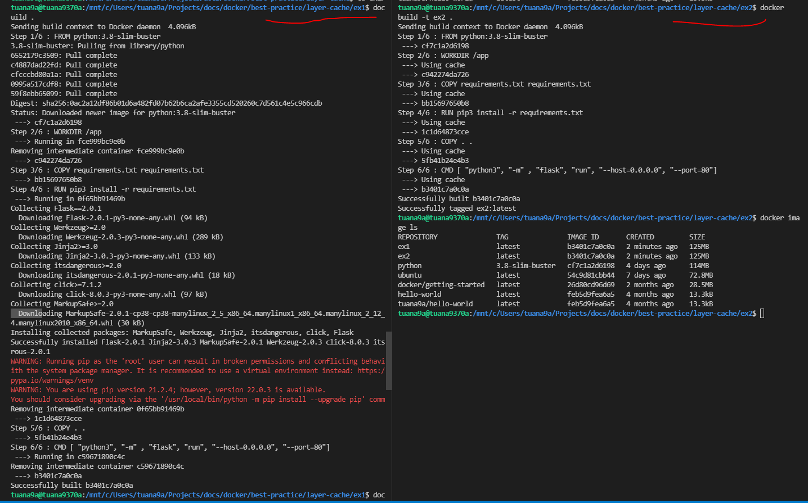

<!DOCTYPE html>
<html lang="en">

<head>
    <meta charset="UTF-8">
    <meta http-equiv="X-UA-Compatible" content="IE=edge">
    <meta name="viewport" content="width=device-width, initial-scale=1.0">
    <title>Docker Layer Cache</title>
</head>

<body>
    <h1></h1>
    <hr>
    <h1></h1>
    <p></p>
    <br>
    <p></p>
    <br>
    <p>cùng xem ví dụ ở trong 2 thư mục <a href="./app1/">app1/</a> và <a href="./app2/">app2/</a> <br>
        mặc dù ở 2 app khác nhau nhưng phần nội dung của 2 bên giống nhau và thậm chí khi build docer sẽ sử dụng tất layer của 2 bên</p>
    <p>cùng xem ảnh phía dưới</p>
    
</body>

</html>

_các layer của docker hoạt động khá hay và hiệu quả_

# Tìm hiểu về Overlay filesystem

TODO: mình không nhớ nữa khá lâu rồi nếu cần thiết thì phải tìm hiểu lại, còn phía dưới chỉ là sơ lược

đại loại các layer là immutable <br>
muốn thay đổi thêm sửa xoá chỉ chỉnh sửa ở layer cao nhất <br>
việc immutable cho phép

-   tối ưu bộ nhớ cho các ứng dụng sử dụng chung phần layer thấp hơn
-   thậm chí cải thiện tốc độ build image kể cả với 2 image khác nhau Dockerfile

    -   chỉ cần chung một or một vài layer sẽ share phần layer này
    -   app1

        -   app.py

        ```python
        from flask import Flask

        app = Flask(__name__)


        @app.route('/')
        def hello():
            return 'Hello, World!'
        ```

        -   requirements.txt

        ```textfile
        Flask==2.0.1
        ```

        -   Dockferfile

        ```dockerfile
        # syntax=docker/dockerfile:1

        FROM python:slim-bullseye

        WORKDIR /app

        COPY requirements.txt requirements.txt
        RUN pip3 install -r requirements.txt

        COPY . .

        CMD [ "python3", "-m" , "flask", "run", "--host=0.0.0.0", "--port=80"]
        ```

    -   app2

        -   app.py

        ```python
        from flask import Flask

        app = Flask(__name__)


        @app.route('/')
        def hello():
            return 'Hello, World!'
        ```

        -   requirements.txt

        ```textfile
        Flask==2.0.1
        ```

        -   Dockferfile

        ```dockerfile
        # syntax=docker/dockerfile:1

        FROM python:slim-bullseye

        WORKDIR /app

        COPY requirements.txt requirements.txt
        RUN pip3 install -r requirements.txt

        COPY . .

        CMD [ "python3", "-m" , "flask", "run", "--host=0.0.0.0", "--port=80"]
        ```

    -   output
        
