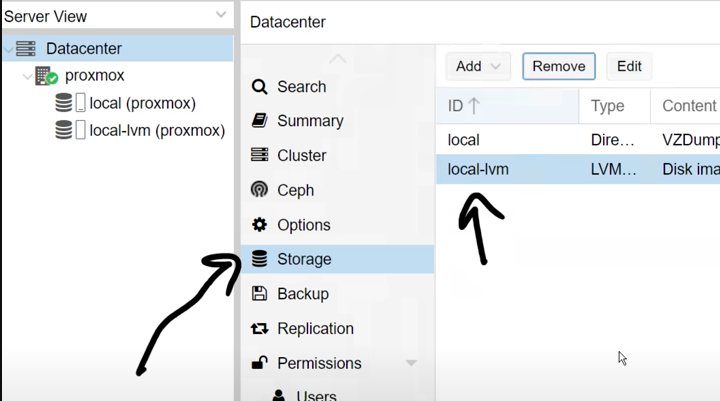
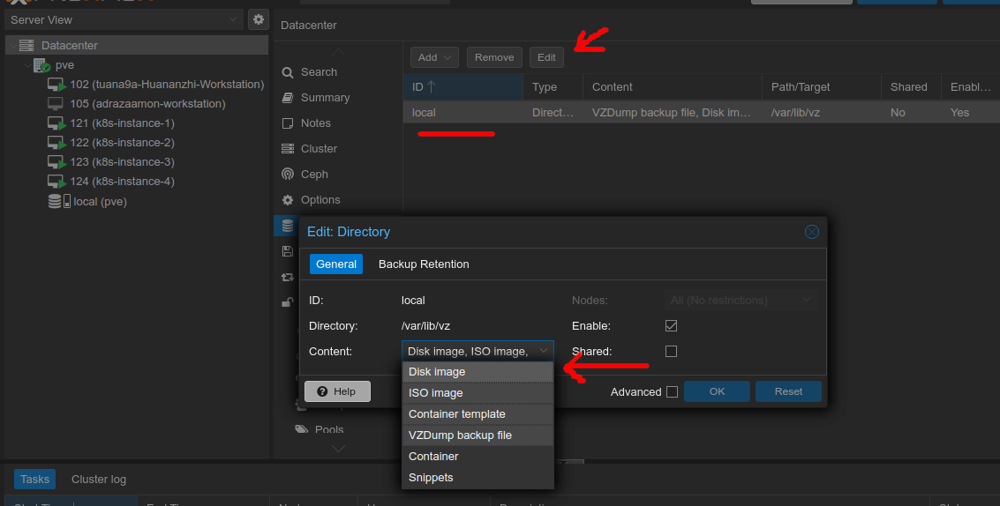

# proxmox

## oidc

Proxmox: [Set up OpenID Connect for Google Login](https://forum.proxmox.com/threads/mobile-web-and-android-app-how-to-log-in-with-google-oauth2-openid.116234/post-563563)

## increase default root storage for storing virtual machines

first remove `local-lvm` via the web-ui.



open the proxmox server shell then type these commands to take 100% disk size.

```bash
lvremove /dev/pve/data
```

```bash
lvresize -l +100%FREE /dev/pve/root
```

```bash
resize2fs /dev/mapper/pve-root
```

then allow disk image for storage



## proxmox resize disk for ubuntu server 18.04

on proxmox host

[https://pve.proxmox.com/wiki/Resize_disks](https://pve.proxmox.com/wiki/Resize_disks)

```bash
qm resize <vmid> <disk> <size>
```

```bash
qm resize 102 scsi0 +80G
```

on virtual machines

[Ubuntu: Extend your default LVM space](https://packetpushers.net/ubuntu-extend-your-default-lvm-space/)

[Ask Ubuntu - Ubuntu Server 18.04 LVM out of space with improper default partitioning](https://askubuntu.com/questions/1106795/ubuntu-server-18-04-lvm-out-of-space-with-improper-default-partitioning)

**NOTE** `cfdisk` step is only needed when you see disk size doens't increase after your resize it on the web ui.

```bash
cfdisk
```

Select `/dev/sda3` (disk you want to resize)

Select `Resize`, Hit `Enter`

Hit `Write`, type `yes`, hit `Enter`

Hit `q` to quit

```bash
pvdisplay
```

```bash
vgdisplay
```

```bash
lvdisplay
```

```bash
sudo lvextend -l +100%FREE /dev/ubuntu-vg/ubuntu-lv
```

```bash
sudo resize2fs /dev/mapper/ubuntu--vg-ubuntu--lv
```

### refs

## how to import from virtual box

[https://credibledev.com/import-virtualbox-and-virt-manager-vms-to-proxmox/#import-virtualbox-vm-to-proxmox](https://credibledev.com/import-virtualbox-and-virt-manager-vms-to-proxmox/#import-virtualbox-vm-to-proxmox)

export virtualbox to `.ova` file

```bash
tar -xvf your-vm.ova
```

create a blank vm on promox (no disk)

```bash
qm importdisk <vmid> your-vm-disk001.vmdk <storage_name> -format qcow2
```

ex:

```bash
qm importdisk 121 k8s-instance-1-disk001.vmdk local -format qcow2
```

then just enable (Add) the disk in proxmox web ui.

# disk migration, re install

https://forum.proxmox.com/threads/properly-remove-an-external-storage.118565/

https://forum.proxmox.com/threads/mount-old-pve-data-disk.93605/

https://pve.proxmox.com/pve-docs/chapter-pmxcfs.html#_recovery

https://forum.proxmox.com/threads/pve7-wipe-disk-doesnt-work-in-gui.92198/
