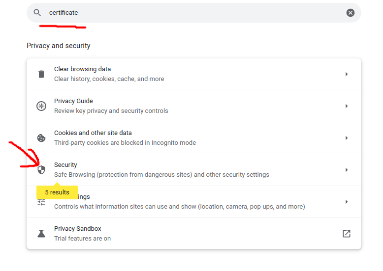
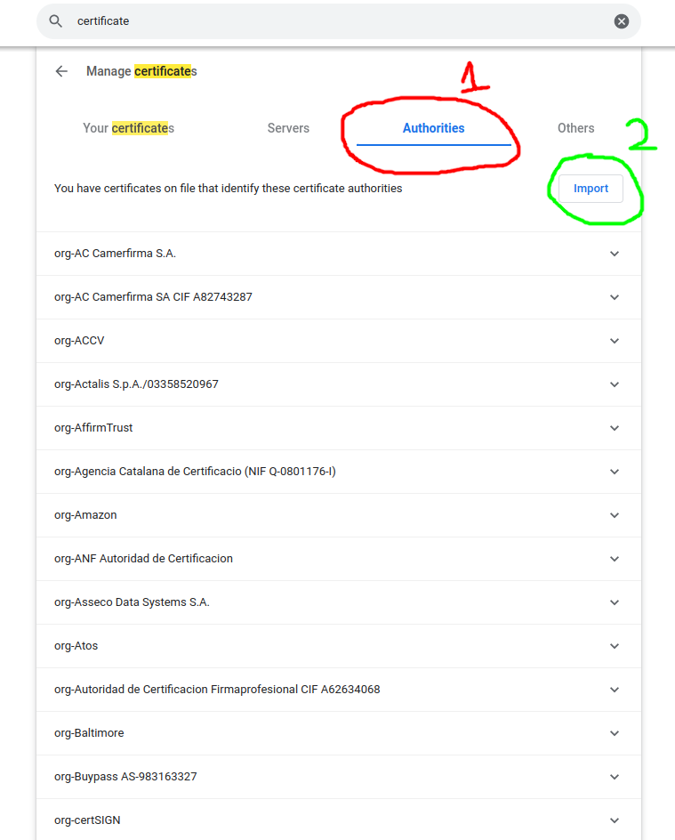

# Make self-sign certificates valid in browser

On Windows browers like: Google Chrome, Firefox, ... automaticaly accept imported CA.\
But in Linux or other distros may be you still need to import CA to the browser manually.\
So after import your CA to you operating system. You may also need to do that again with your browser

### Chrome (Jun 29, 2022)

open Chrome Settings, then search for `certificates` then click click `Security`

next choose `Manage certificates`

choose tab `Authorities` then click `Import`

browse the `ca.crt` as generated above, then the browser will ask

check as image below

result

## Firefox

same as chrome, do your research 👽
