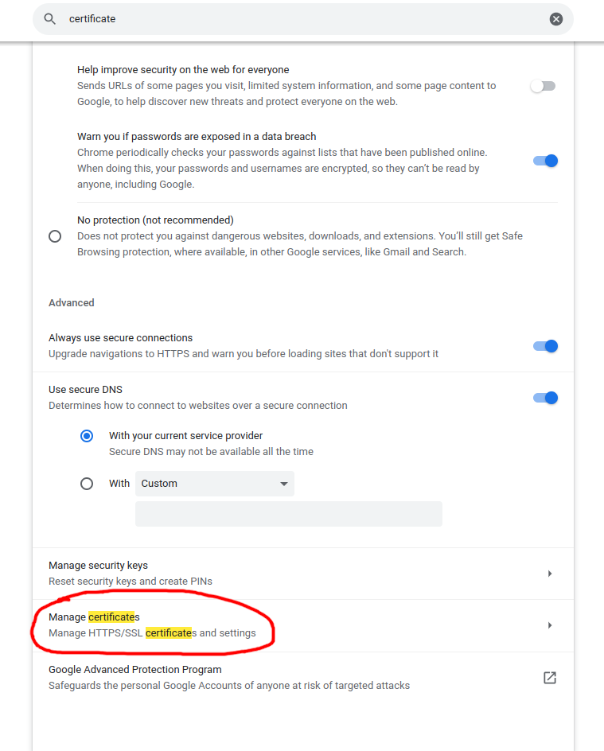
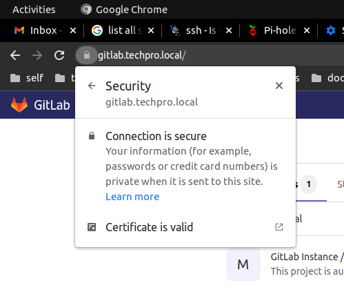

# Info

Thanks **[Bui Manh Truong](https://github.com/mtb-hust)** and **[Techpro.vn](https://techpro.vn)** for give me chance to work as a DevOps when I'm still a college student of HUST

## Steps to create your SSL with your own CA (Self Sign Certificate)

### create ca key

```bash
openssl genrsa -out rootCA.key 4096
```

### create ca cert

```bash
openssl req -new -subj "/C=VN/ST=HN/O=Techpro AI/CN=Techpro AI" -x509 -sha256 -days 3650 -key rootCA.key -out rootCA.crt
```

### create server key

```bash
openssl genrsa -out server.key 4096
```

### create cert request

```bash
openssl req -new -sha256 -subj "/CN=Techpro AI" -key server.key -out server.csr
```

### create cert

(option 1) with extfile.cnf

```bash
echo "subjectAltName=DNS.1:techpro-ai.local,DNS.2:*.techpro-ai.local" > extfile.cnf
openssl x509 -req -sha256 -days 3650 -in server.csr -CA rootCA.crt -CAkey rootCA.key -out server.crt -extfile extfile.cnf -CAcreateserial
```

(option 2) inline

```bash
openssl x509 -req -sha256 -days 3650 -in server.csr -CA rootCA.crt -CAkey rootCA.key -out server.crt -extfile <(printf "subjectAltName=IP.1:172.19.0.11,IP.2:172.19.0.12,IP.3:172.19.0.13") -CAcreateserial
```

`subjectAltName` examples

one domain name

```cnf
subjectAltName=DNS:techpro-ai.local
```

one ip

```cnf
subjectAltName=IP:172.19.0.11
```

multiple domain names (include wildcard)

```cnf
subjectAltName=DNS.1:techpro-ai.local,DNS.2:*.techpro-ai.local
```

multiple ips

```cnf
subjectAltName=IP.1:172.19.0.11,IP.2:172.19.0.12,IP.3:172.19.0.13
```

### (optional) create fullchain cert

```bash
cat server.crt rootCA.crt > fullchain.crt
```

### (optional) import CA to your operating system

remove old CA (if existed)

```bash
sudo rm /usr/local/share/ca-certificates/ca.crt
sudo update-ca-certificates -f
```

copy new ca to destination

```bash
sudo cp rootCA.crt /usr/local/share/ca-certificates/ca.crt
sudo update-ca-certificates
```

## Bonus: Make self-sign certificates valid in browser

On Windows browers like: Google Chrome, Firefox, ... automaticaly accept imported CA.\
But in Linux or other distros may be you still need to import CA to the browser manually.\
So after import your CA to you operating system. You may also need to do that again with your browser

### Chrome (Jun 29, 2022)

open Chrome Settings, then search for `certificates` then click click `Security`


next choose `Manage certificates`



choose tab `Authorities` then click `Import`


browse the `rootCA.crt` as generated above, then the browser will ask

check as image below


result



## Firefox

same as chrome, do your research 👽

## Refs

[Self Signed Certificate with Custom Root CA](https://gist.github.com/fntlnz/cf14feb5a46b2eda428e000157447309)

[How to create a valid self signed SSL Certificate?](https://www.youtube.com/watch?v=VH4gXcvkmOY)

[https://github.com/xcad2k/cheat-sheets/blob/main/misc/ssl-certs.md](https://github.com/xcad2k/cheat-sheets/blob/main/misc/ssl-certs.md)
