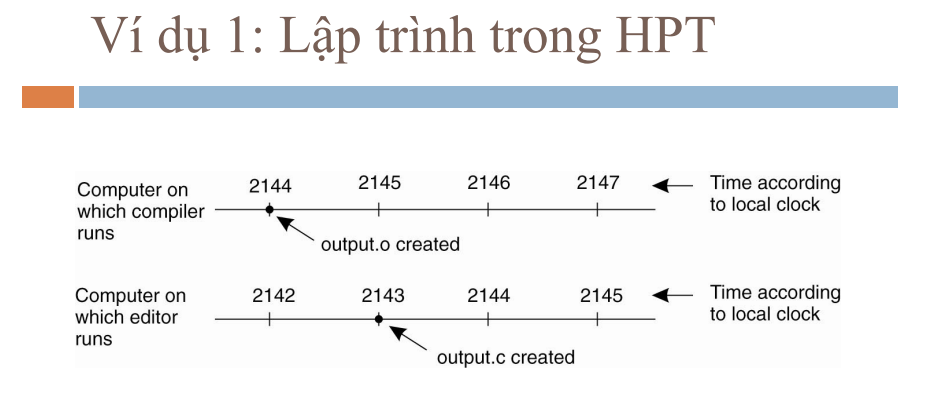
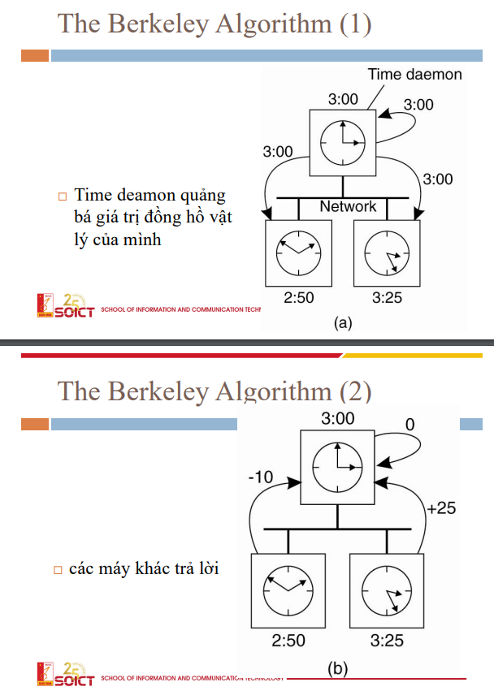

# Đồng bộ hoá đồng hồ vật lý

với những nghiệp vụ dựa vào thời gian để xử lý 
ta có thể xử lý bằng cách đồng bộ đồng hồ vật lý 
để giúp chương trình chạy đúng trên các node

ở ví dụ này là bài toán về editor và compiler 
chương trình compiler sẽ chỉ compile 
khi phát hiện chỉnh sửa sau lần compile gần nhất

nếu thời gian bị lệch 
rất có thể phía máy compile sẽ detect thời gian edit 
là trước compile mà thực tế là ngược lại

từ đó dẫn tới không compile, vậy là sai logic chương trình

## định vị toàn cầu GPS

thời gian truyền tính hiệu lên trạm bị nước, khí quyển dẫn tới sai lệch

## bản chất của đồng hồ

tinh thể thạch anh, IC, clock speed rõ ràng khác nhau trên mọi máy 
nên luôn luôn có hiện tượng sai lệch

# Giải pháp</h1>

-   network time protocol
-   thuật toán berkeley
-   đồng bộ vật lý trong mạng không dây

## network time protocol

bằng cách sử dụng một single source of truth, 
dùng đồng hồ nguyên tử để làm điểm so sánh 
các thiết bị khi có kết nối internet sẽ check sau một khoảng thời gian

cách này được ứng dụng rất phổ biển ở mọi thiết bị, 
để ý ngay khi kết nối internet thời gian sẽ được tự điều chỉnh lại cho chuẩn

## thuật toán berkeley

bằng cách sử dụng cơ chế quảng bá và một node nguồn, 
sẽ liên tục broadcast "hỏi thăm" các node khác và yêu cầu chúng cập nhật

